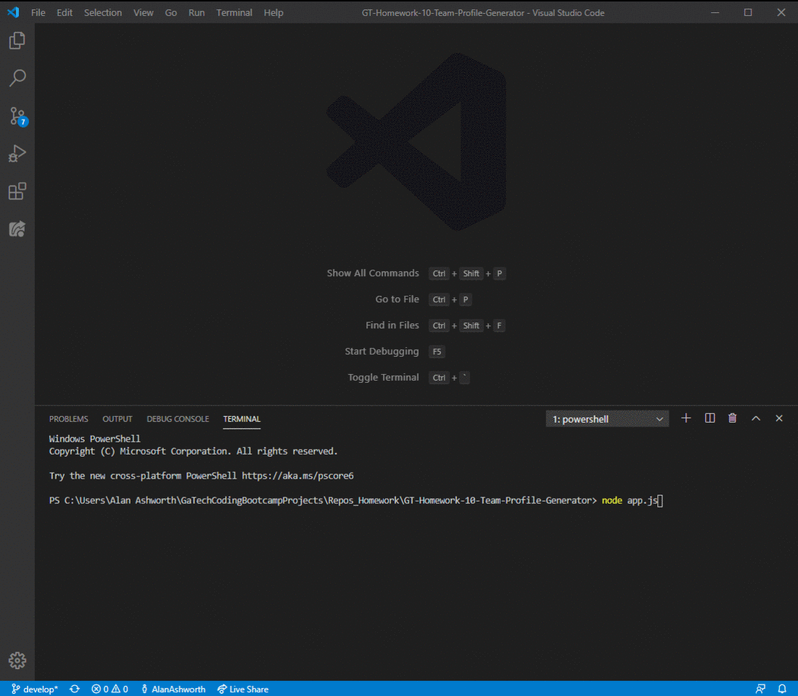

# GT-Homework-10-Team-Profile-Generator

A Node CLI that takes in information about employees and generates an HTML webpage that displays summaries for each person.

## Description

The application will prompt the user for information about the team manager and then information about the team members. The user can input any number of team members, and they may be a mix of engineers and interns.

## Table of Contents

* [Installation](#installation)
* [Usage](#usage)
* [Tests](#tests)
* [Contributing](#contributing)
* [Repository](#repository)
* [Questions](#questions)
* [License](#license)

## Installation

Install the necessary dependencies in the command line with:

```sh
npm install
```

## Usage

After dependencies are installed, run the application in the command line with:

```sh
node app.js
```

The following demonstrates application functionality:



## Tests

To run tests, please run the following command:

```
npm run test
```

## Contributing

None.

## Repository

[Github Repository](https://github.com/AlanAshworth/GT-Homework-10-Team-Profile-Generator)

## Questions


Contact me at <a href="mailto:awashworth927@gmail.com">awashworth927@gmail.com</a>

## License

© 2019 Trilogy Education Services, a 2U, Inc. brand. All Rights Reserved.